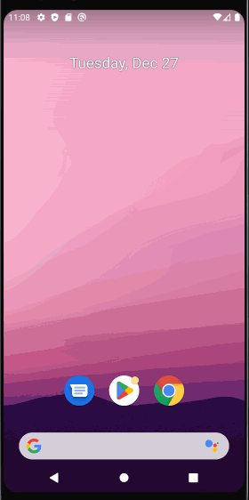

# Android Prework - *HelloWorld*

Submitted by: **Malhiya Arnib**

**HelloWorld** is an android app that shows an image and introductory message, and allows pressing a button to display a Toast. 

Time spent: about **6-7** hours spent in total

## Required Features

The following **required** functionality is completed:

* [x] Image and introductory message displayed on screen
* [x] Button displayed on screen
* [x] Toast with message appears when button is pressed 

The following **optional** features are implemented:
* Added a new drawable resource file to create a gradient background
* Added a new font file 
* Pressing on the button allows the user to change into a light or dark display theme
* In the two themes, the button, button text, layout background, and introductory message text change color

* [X] List anything else that you can get done to improve the app functionality!
* I would try to change the color of the default purple header bar at the top 
* I would also try to find a way to make the dark theme background to be the initial custom gradient background(rather than the few available colors)

## Video Walkthrough

Here's a walkthrough of implemented features:

<!-- Replace this with whatever GIF tool you used! -->
GIF created with LiceCap  
<!-- Recommended tools:
[Kap](https://getkap.co/) for macOS
[ScreenToGif](https://www.screentogif.com/) for Windows
[peek](https://github.com/phw/peek) for Linux. -->

## Notes

Describe any challenges encountered while building the app.

* I had a few challenges when building the app. The first issue was not having the text be in the custom font when I ran the app. 
After searching on Google as to what the problem might be, I figured out that I was referencing an .xml file instead of a .ttf file. 
This problem was resolved when I created and referenced to the .ttf font file.

* Another challenge I encountered was knowing how to have 1 button be used for two different functions (display two different themes). 
While searching how to solve the issue, I found a YouTube video which solved a similar problem. I was specifically having trouble using a boolean where
the theme would change back right away after pressing the button. This is where the video introduced having an int variable to keep track
of the mode. For my app, the int variable would have 3 modes. One for the light theme, one for the dark theme, and specifically a mode to be in neutral. The 
neutral mode (int = 2) would help stop the theme from changing back after the button was pressed.
YouTube video I referenced: https://www.youtube.com/watch?v=DpyJZ-f6xVg 

* The final challenge I encountered was having the dark theme be the intial gradient background I had before pressing the button. I tried searching 
for a solution to this problem but couldn't find any so far. I still plan to research more about this and try to change it after my initial submission.

## License

    Copyright 2022 Malhiya Arnib

    Licensed under the Apache License, Version 2.0 (the "License");
    you may not use this file except in compliance with the License.
    You may obtain a copy of the License at

        http://www.apache.org/licenses/LICENSE-2.0

    Unless required by applicable law or agreed to in writing, software
    distributed under the License is distributed on an "AS IS" BASIS,
    WITHOUT WARRANTIES OR CONDITIONS OF ANY KIND, either express or implied.
    See the License for the specific language governing permissions and
    limitations under the License.
